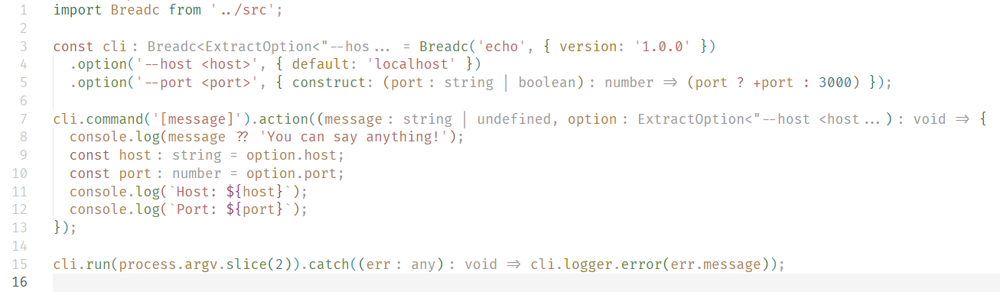

# 🥪 Breadc

[](https://www.npmjs.com/package/breadc) [](https://github.com/yjl9903/Breadc/actions/workflows/ci.yml) [](https://codecov.io/gh/yjl9903/Breadc)

Yet another Command Line Application Framework with fully strong **[TypeScript](https://www.typescriptlang.org/) support**.



## Features

+ ⚡️ **Light-weight**: Only 75 kB (Unpacked);
+ 🔍 **TypeScript Infer**: IDE will automatically infer the type of your command action function;
+ 💻 **Commands**: Support default command, command alias and sub-commands like `git remote add <name> <url>`;
+ 📖 **East to Learn**: Breadc is very similar with [cac](https://github.com/cacjs/cac) and there are only 5 APIs for building a CLI application: `breadc`, `command`, `option`, `action`, `run`.

## Installation

```bash
npm i breadc
```

## Usage

Try [./examples/echo.ts](./examples/echo.ts).

```ts
import { breadc } from 'breadc'

const cli = breadc('echo', { version: '1.0.0' })
  .option('--host <host>', { default: 'localhost' })
  .option('--port <port>', { default: '3000', cast: p => +p })

cli
  .command('[message]', 'Say something!')
  .action((message, option) => {
    const host = option.host
    const port = option.port
    console.log(`Host: ${host}`)
    console.log(`Port: ${port}`)
  })

cli.run(process.argv.slice(2)).catch(err => console.error(err))
```

If you are using IDEs that support TypeScript (like [Visual Studio Code](https://code.visualstudio.com/)), input something using `option`, and then you will find the `option` is automatically typed with `{ host: string, port: number }`. In the figure below, [Visual Studio Code](https://code.visualstudio.com/) will automatically infer that the type of `option.host` is `string` and the type of `option.port` is `number`.


### Limitation

For the limitation of TypeScript, in the command format string, you can only write up to **5** pieces. That is to say, you can only write format string like `<p1> <p2> <p3> <p4> [p5]`, but `<p1> <p2> <p3> <p4> <p5> [p6]` does not work.

You should always use method chaining when registering options and commands. The example below will fail to infer the option `--host`.

```ts
const cli = Breadc('cli')

cli
  .option('--host')

cli
  .option('--port')
  .command('')
  .action((option) => {
    // The type of option is only { port: boolean }
  })
```

## Inspiration

+ [cac](https://github.com/cacjs/cac): Simple yet powerful framework for building command-line apps.
+ [TypeScript: Documentation - Template Literal Types](https://www.typescriptlang.org/docs/handbook/2/template-literal-types.html)

## License

MIT License © 2023 [XLor](https://github.com/yjl9903)
