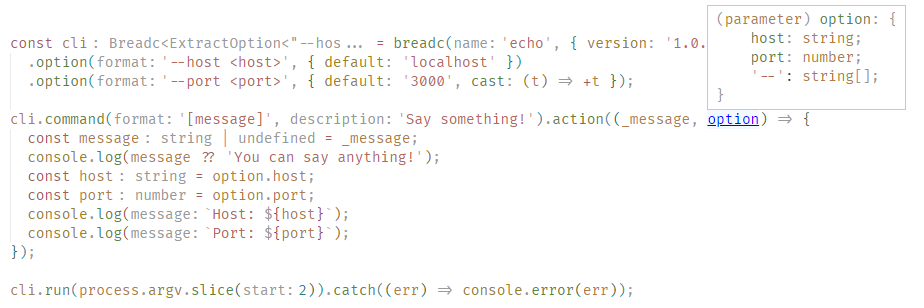

# Breadc

[](https://www.npmjs.com/package/breadc) [](https://github.com/yjl9903/Breadc/actions/workflows/ci.yml)

Yet another Command Line Application Framework powered by [minimist](https://www.npmjs.com/package/minimist), but with fully strong [TypeScript](https://www.typescriptlang.org/) support.

## Features

+ ⚡️ **Light-weight**: Only 40 kB (Unpacked).
+ 📖 **East to Learn**: Breadc is basically compatible with [cac](https://github.com/cacjs/cac) and there are only 5 APIs for building a CLI application: `Breadc`, `command`, `option`, `action`, `run`.
+ 💻 **TypeScript Infer**: IDE will automatically infer the type of your command action function.

## Installation

```bash
npm i breadc
```

## Usage

Try [./examples/echo.ts](./examples/echo.ts).

```ts
import Breadc from 'breadc'

const cli = Breadc('echo', { version: '1.0.0' })
  .option('--host [host]', { default: 'localhost' })
  .option('--port [port]', { construct: (port) => (port ? +port : 3000) });

cli
  .command('[message]', 'Say something!')
  .action((message, option) => {
    const host = option.host;
    const port = option.port;
    console.log(`Host: ${host}`);
    console.log(`Port: ${port}`);
  })

cli.run(process.argv.slice(2))
  .catch(err => cli.logger.error(err.message))
```

If you are using IDEs that support TypeScript (like [Visual Studio Code](https://code.visualstudio.com/)), input something using `option`, and then you will find the `option` is automatically typed with `{ host: string, port: number }`. In the figure below, [Visual Studio Code](https://code.visualstudio.com/) will automatically infer that the type of `option.host` is `string` and the type of `option.port` is `number`.



### Limitation

For the limitation of TypeScript, in the command format string, you can only write up to **5** pieces. That is to say, you can only write format string like `<p1> <p2> <p3> <p4> [p5]`, but `<p1> <p2> <p3> <p4> <p5> [p6]` does not work.

You should always use method chaining when registering options and commands. The example below will fail to infer the option `--host`.

```ts
const cli = Breadc('cli')

cli
  .option('--host')

cli
  .option('--port')
  .command('')
  .action((option) => {
    // The type of option is Record<'port', string>
  })
```

## Inspiration

+ [cac](https://github.com/cacjs/cac): Simple yet powerful framework for building command-line apps.
+ [TypeScript: Documentation - Template Literal Types](https://www.typescriptlang.org/docs/handbook/2/template-literal-types.html)

## License

MIT License © 2021 [XLor](https://github.com/yjl9903)
