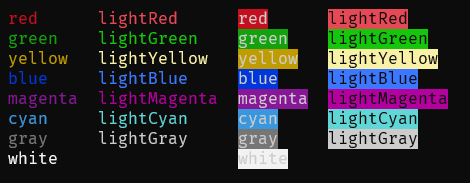

# @breadc/color

[](https://www.npmjs.com/package/@breadc/color) [](https://github.com/yjl9903/Breadc/actions/workflows/ci.yml)



## Installation

```bash
npm i @breadc/color
```

## License

MIT License © 2023 [XLor](https://github.com/yjl9903)
